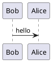
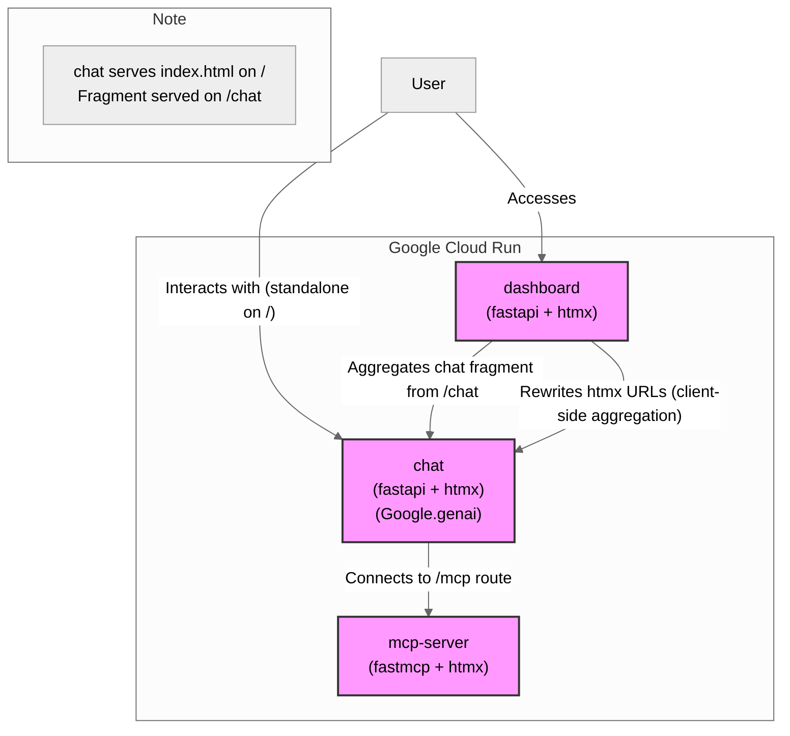

# sbotify

# Run Client with stdio

Add server.py to .env:

```bash
MCP_SERVER_URL=mcp-server/server.py
```

```bash
uv run mcp-client/client.py
```

# Run local chat with remote MCP server
```bash
#Make tunnel to the Cloud Run mcp server
gcloud run services proxy sbotify-mcp-server --region=europe-west4
```

# Run remote chat
```bash
#Make tunnel to the Cloud Run chat server
gcloud run services proxy sbotify-chat --region=europe-west4
# Traffic to http://localhost:8080 will be authenticated and send to remote mcpserver

# You can connect browser to http://127.0.0.1:8080, it will handle authentication
# and show remote chat
```


# Run with remote server:
[build-and-deploy-mcp-server-to-cloud-run](https://cloud.google.com/blog/topics/developers-practitioners/build-and-deploy-a-remote-mcp-server-to-google-cloud-run-in-under-10-minutes)

Make sure that you or any team members trying to access the remote MCP server have the roles/run.invoker IAM role bound to their IAM principal (Google Cloud account).


All traffic to http://127.0.0.1:8080 will now be authenticated and forwarded to our remote MCP server.


# Cloud Run connectivity
https://cloud.google.com/run/docs/tutorials/secure-services
https://medium.com/google-cloud/using-google-identity-aware-proxy-iap-with-cloud-run-without-a-load-balancer-27db89b9ed49


# Chat

```bash
uvicorn src.main:app --reload
uvicorn chat.src.main:app --reload-dir chat\src --env-file .env
```

```
gcloud compute networks vpc-access connectors create sboPtify-connector \
--region=europe-west4 \
--network=default \
--range="10.8.0.0/28"

gcloud run services update sbotify-dashboard \
--region=europe-west4 \
--vpc-connector=sbotify-connector \
--vpc-egress=all-traffic
```




